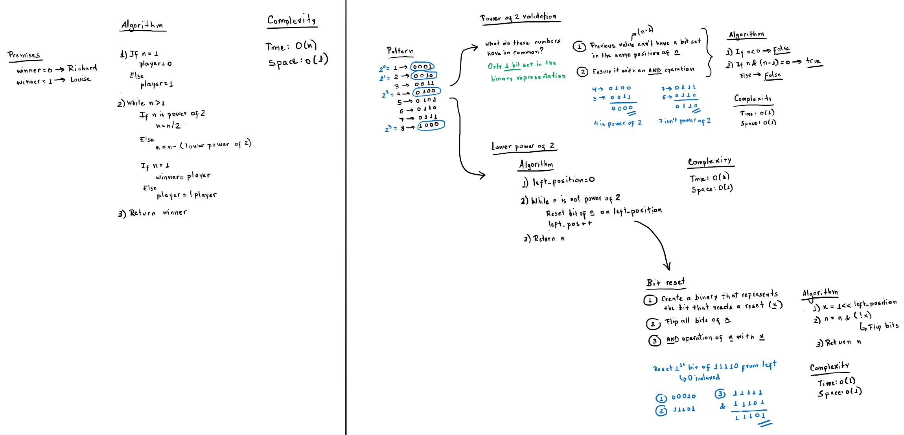

# Counter Game

The problem description can be found [here](https://www.hackerrank.com/challenges/counter-game/problem).

## Solution



The implementation can be found on [main.rs](./src/main.rs) file.

## Running the solution

In this directory, build and run the solution with Cargo:

```rs
cargo run
```

Then pass the input values to stdin.
