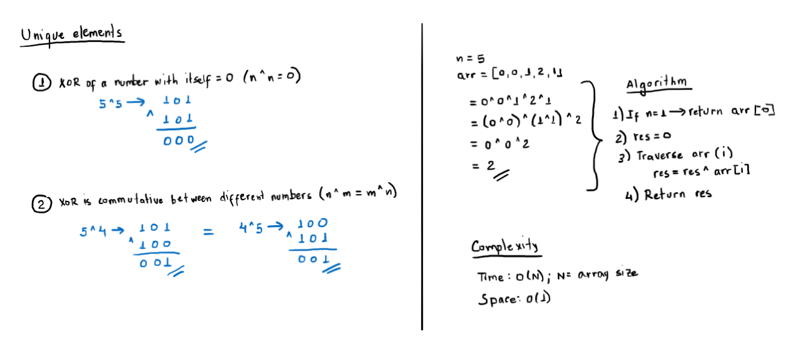

# Lonely Integer

The problem description can be found [here](https://www.hackerrank.com/challenges/lonely-integer/problem).

## Solution



## Running the solution

In this directory, build and run the solution with Cargo:

```rs
cargo build
```

Then pass the input values to stdin.
